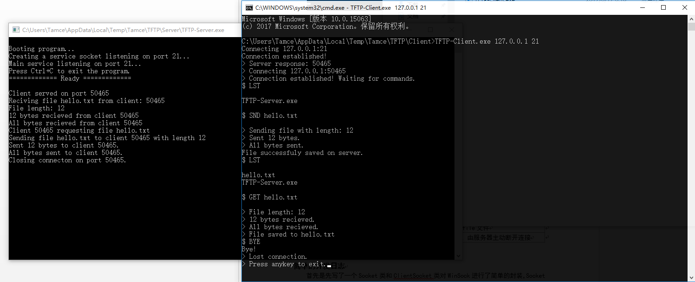

# TFTP 简单文件传输
- [TFTP 简单文件传输](#tftp-简单文件传输)
  - [1. 这是什么？](#1-这是什么)
  - [2. 它的基本功能是什么？](#2-它的基本功能是什么)
  - [3. 程序的大体设计是怎样的？](#3-程序的大体设计是怎样的)
  - [4. 运行截图](#4-运行截图)
  - [5. 如何编译运行？](#5-如何编译运行)
    - [编译](#编译)
    - [执行](#执行)
## 1. 这是什么？
这是我的 `计算机网络` 课程实验，实验要求通过 tcp 传输文件，基于这个基本的实验要求，我实现了一个可接受多客户端、支持命令的简单文件传输程序。

## 2. 它的基本功能是什么？
* 基于 `tcp` 传输数据
* 支持多客户端连接
* 命令式交互，支持用户输入
* 可列出文件、上传、下载文件

## 3. 程序的大体设计是怎样的？
源码均在 `src` 文件夹下，其中 `Socket.h` 是我自行简单封装的 `Socket` 类，而客户端和服务端的代码则放在了相应的文件夹中。  
> 其中有一个地方的右值问题依稀记得是使用 std::move 临时解决的，而且列出文件列表也是偷懒直接调用 `cmd` 指令了（x

具体内容请参见实验报告文档（[doc.pdf](doc.pdf)），关于大体的协议设计、缺点等都在里面有描述。  
而较详细的编码过程可以看 git 提交记录和代码。

## 4. 运行截图

## 5. 如何编译运行？
### 编译
> 由于使用的是 `winsock`，`g++` 不支持 `lib` 库，所以需要使用 `VS` 系编译器编译。

 我使用的编译环境为 `VS2015`，测试通过。

### 执行
1. 服务端可直接双击运行，不接受参数
2. 客户端接受两个参数运行，分别为 `服务器ip`，`服务器端口`
3. 具体操作请参见实验报告文档（[doc.pdf](doc.pdf)）

---
我的博客： https://blog.tamce.cn  
我的个人公众号：  

